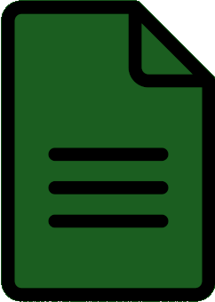

#    CSV Reader

[](https://travis-ci.com/samuel-cavalcanti/csv_reader)
[](https://codecov.io/gh/samuel-cavalcanti/csv_reader)

Aplicativo Android para __APENAS__ visualizar arquivos Comma-Separated-Values (CSV).
Esse aplicativo foi criado com duas finalidades
- examinar o funcionamento do
[flutter channel](https://flutter.dev/docs/development/platform-integration/platform-channels) no android  
- Ter um aplicativo para visualizar no smart phone o arquivo gerado pelo [FindByColor](https://play.google.com/store/apps/details?id=cavalcanti.samuel.findbycolor2&hl=en_US&gl=US)

## Para rodar testes

```sh
flutter test
```


## Exemplo de demostração

<p align="center">
  
</p>


## Descobertas

- [Flutter Launcher Icons](https://pub.dev/packages/flutter_launcher_icons)
Command line Aplication que simplifica a atualização do ícone do app  

- [Flutter Provider](https://pub.dev/packages/provider)
wrapper em cima do InheritedWidget que facilitou a arquitetura do app

- [Flutter File Picker](https://pub.dev/packages/file_picker)
Código razoavelmente entendível, funciona mas não foi encontrado testes automatizados...